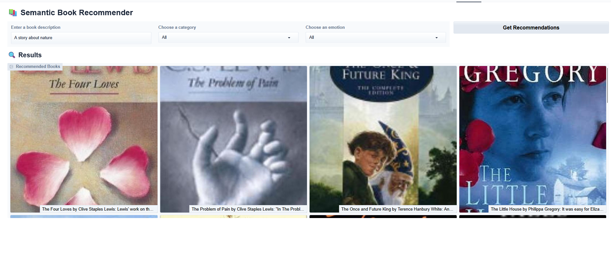

# 📚 BookSage: AI-Powered Semantic Book Recommender

BookSage is a smart book recommender app that uses **semantic search** and **emotion detection** to help you find the right book based on your mood, interest, or description. Just describe a story, pick a tone or category, and BookSage gives you personalized suggestions instantly.

---

## 🖼 Screenshot

> 📷 Upload your app screenshot as `screenshot.png` in the root folder.



---

## 🔍 Features

- 🧠 **Semantic Search** with Hugging Face Sentence Transformers
- 🎭 **Emotion Filtering** (Joy, Sadness, Anger, Fear, Surprise)
- 🗂️ **Category Filtering** (Fiction, Sci-Fi, Biography, etc.)
- 🌐 **Gradio Web UI** — instant and interactive
- 📦 **ChromaDB + LangChain** for fast vector-based retrieval
- 🧪 **Notebook-based Exploration** of books, genres, and sentiments

---

## ⚙️ Tech Stack

- `Python`
- `Gradio`
- `LangChain`
- `ChromaDB`
- `Sentence-Transformers`
- `Transformers`
- `Pandas`, `NumPy`

---


## 📁 Project Structure

```text
BookSage/
│
├── gradio-dashboard.py               # Main app script (Gradio-based UI)
├── README.md                    # Project description
├── requirements.txt             # Python dependencies
├── screenshot.png               # 📷 Upload manually
│
├── books_with_emotions.csv      # Book data with emotion scores
├── tagged_description.txt       # Tagged descriptions for embedding
├── cover-not-found.jpg          # Default book cover
│
├── data-exploration.ipynb       # Dataset exploration (optional)
├── sentiment-analysis.ipynb     # Sentiment classification (optional)
├── text-classification.ipynb    # Genre classification (optional)
├── vector-search.ipynb          # Embedding + vector search trials
│```
